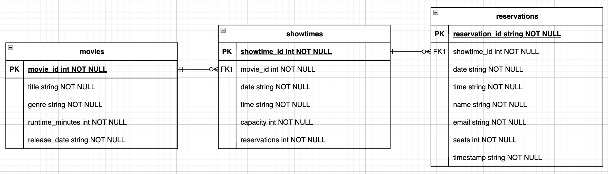

# Cinema World+

Author: Jordan Ali Hilado, jordanalihilado@gmail.com

### Tech stack and libraries

- [Scala](https://scala-lang.org/): Primary language
- [Play Framework](https://www.playframework.com/): Scala web framework
- [Slick](https://scala-slick.org/): Functional Relational Mapping for Scala
- [circe](https://circe.github.io/circe/): JSON library for Scala
- [PostgreSQL](https://www.postgresql.org/): Relational database
- [Docker](https://www.docker.com/): Containerization platform

> NOTE: This project was jumpstarted using Play Framework's [Play Hello World Web Tutorial for Scala
> ](https://github.com/playframework/play-samples/tree/3.0.x/play-scala-hello-world-tutorial)

## Setup

### Prerequisites

1. Ensure that Scala and PostgreSQL are downloaded:
   - Scala: https://www.scala-lang.org/download/
   - PostgreSQL: https://www.postgresql.org/download/
2. Clone this repository
3. Activate your PostgreSQL database

### Running locally

1. At the bottom of `application.conf`, replace the `cinemaWorldDB` fields with your own database credentials
2. From root, run `sbt run`
   - Application homepage: http://localhost:9000/
3. Run database setup by accessing the `http://localhost:9000/setup` endpoint
4. You may now begin testing endpoints!

## Architecture

### Endpoints

| Method | Endpoint   | Controller                                                           | Description                                                      |
| ------ | ---------- | -------------------------------------------------------------------- | ---------------------------------------------------------------- |
| GET    | /movies    | `movies`                                                             | Returns all the movies                                           |
| GET    | /showtimes | `showtimes`                                                          | Returns all the showtimes                                        |
| GET    | /movie     | `movie(movie_id: Int)`                                               | Returns movie details given a `movie_id`                         |
| GET    | /setup     | `setup`                                                              | Initializes the `movies`, `showtimes`, and `reservations` tables |
| POST   | /reserve   | `reserve(showtime_id: Int, name: String, email: String, seats: Int)` | Creates a reservation                                            |
| GET    | /cancel    | `cancel(reservation_id: String)`                                     | Cancels a reservation                                            |

### Database schema

## Testing

Run `sbt test` to run tests for business logic and endpoints.

> Custom tests for business logic and endpoints are located in `test/FunctionalSpec.scala`

### Other references
- [Mockaroo](https://www.mockaroo.com/): Fake data generator